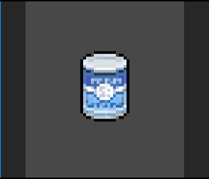

# Unity_URP_Shader

Unity 2022.3.17 Shader学习与实现

### 预览
* A sample study for compute shader, drop pixels compare to the total pixels count with percent  
  

### 参考链接

* [Example of using compute to animate texture pixels](https://github.com/cinight/MinimalCompute/tree/master)
