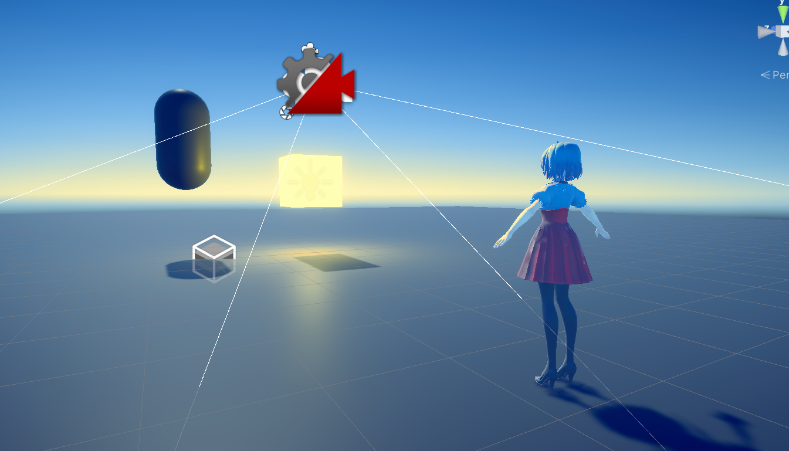

# Unity_URP_Shader

Unity 2022.3.2 Shader学习与实现

效果：

稍微按照参考开了节点

Reference Links:
* [Unity VFX Graph - Heat Distortion Effect Tutorial](https://www.youtube.com/watch?v=CXCyVDEplyM)
* [URP-Transparent-Distortion-Example](https://github.com/lukakldiashvili/URP-Transparent-Distortion-Example)
